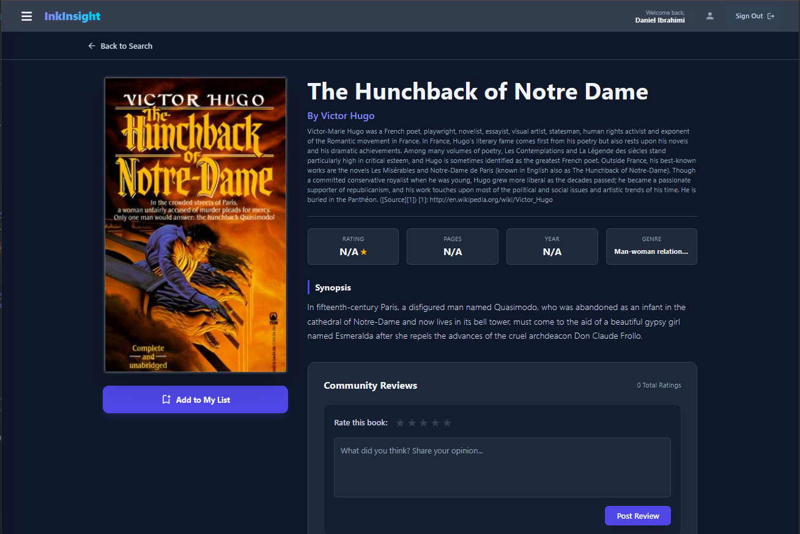
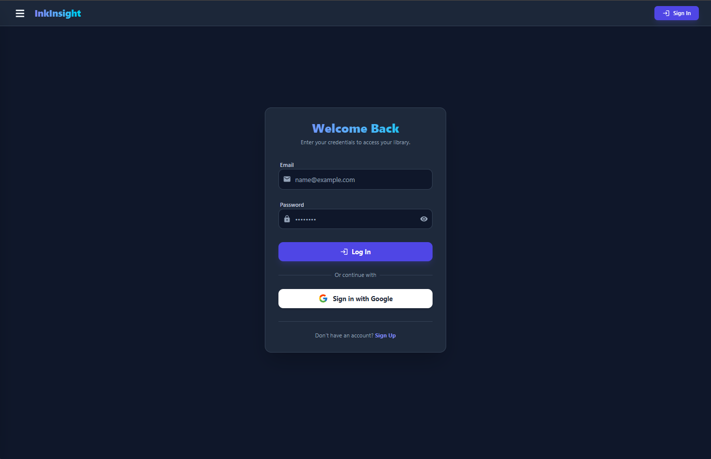
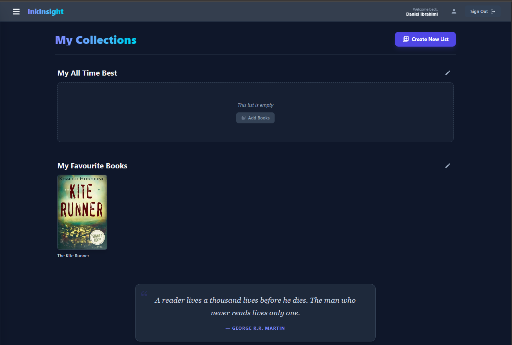

# InkInsight

InkInsight is a lightweight single-page application that helps book lovers discover books, manage custom reading lists, and share ratings. The project is built with modern front-end tooling and uses Firebase for authentication and persistence.

Check out the app here: https://inkinsight-62df5.web.app

**Screenshots**

<p align="center">
  
  
  
  
</p>

**Table of contents**

- [About](#about)
- [Features](#features)
- [Tech stack](#tech-stack)
- [Project structure](#project-structure)
- [Getting started](#getting-started)
- [Firebase configuration](#firebase-configuration)
- [Available scripts](#available-scripts)
- [Contributing](#contributing)
- [License](#license)

## About

InkInsight provides an intuitive UI for searching books, viewing detailed metadata, creating and editing personalized lists, and rating books. It aims to be a minimal, usable companion for readers who want to organize and reflect on their reading.

## Features

- **Authentication:** Sign up, sign in, and sign out with Firebase Authentication.
- **Book discovery:** Search and view book metadata (title, author, cover image, description, page count, ISBN, ratings) via a third-party API integration.
- **Custom lists:** Create, rename, and delete lists; add and remove books from lists.
- **Ratings & reviews:** Rate books with a 1–5 star system and persist ratings.
- **Offline-friendly:** Local persistence helpers use `localStorage` to keep basic state between sessions.

## Tech stack

- **Frontend:** React (JSX) with functional components and hooks.
- **Bundler / Dev server:** Vite for fast development and optimized builds.
- **State management:** Redux Toolkit (`store` + slices) for global state.
- **Backend / Persistence:** Firebase (Authentication + Firestore) for user accounts and data storage.
- **APIs:** A remote books API (configured via `src/config/apiConfig.js`) for book metadata.
- **Utilities:** Small helpers in `src/utilities` for validation and common operations.
- **Styling:** TailwindCSS inline styling in views found in `src/view`.

## Project structure (selected files)

- `index.html` — app entry HTML
- `src/index.jsx` — React entry point
- `src/app.jsx` — top-level router and providers
- `src/config/apiConfig.js` — external API configuration
- `src/config/firebaseConfig.js` — Firebase setup (fill with your keys)
- `src/database/firebase.js` — Firebase helpers used across the app
- `src/store/` — Redux Toolkit slices and store configuration
- `src/presenter/` — presenter modules containing business logic
- `src/view/` — presentational React components and styles

## Getting started

Prerequisites

- Node.js (v16+ recommended)
- npm (or Yarn)

Install and run locally

```bash
npm install
npm run dev
```

This starts the Vite dev server (default `http://localhost:5173`).

Build for production

```bash
npm run build
npm run preview
```

## Firebase configuration

1. Create a Firebase project and enable Authentication and Firestore.
2. Copy your Firebase config values into `src/config/firebaseConfig.js` following the existing file shape.
3. Ensure any API keys or secrets are handled appropriately for production (use environment variables for CI/deploy).

If you prefer, create a `.env` file and reference values from your config files rather than committing secrets.

## Available scripts

- `npm run dev` — run the development server
- `npm run build` — build the production bundle
- `npm run preview` — locally preview the production build

## Contributing

Contributions are welcome. If you plan to contribute:

1. Open an issue to discuss changes or features.
2. Create a branch for your work.
3. Submit a pull request with a clear description of changes.

## License

This project includes a top-level `LICENSE` file. Refer to it for license details.

## Contact

For questions or to share feedback, open an issue or contact the repository owner.
